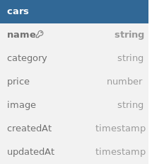

ini database diagram dari challenge Binar chapter 4:

api di challenge ini :

1. git clone ..
2. npm install
3. buat file .env, copy env variable dari .env.example
4. npm run dev

port= localhost:8000

- /dashboard= get all cars page
- /dashboard/create (GET) = ini halaman untuk create new car
- /cars/add (POST) = ini API action untuk create new car
- /dashboard/edit/:id (GET) = ini halaman untuk edit car
- /cars/update/:id (POST) = ini API action untuk update car
- /cars/delete/:id (POST) = ini API action untuk delete car
